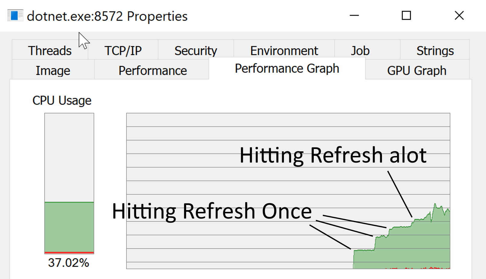
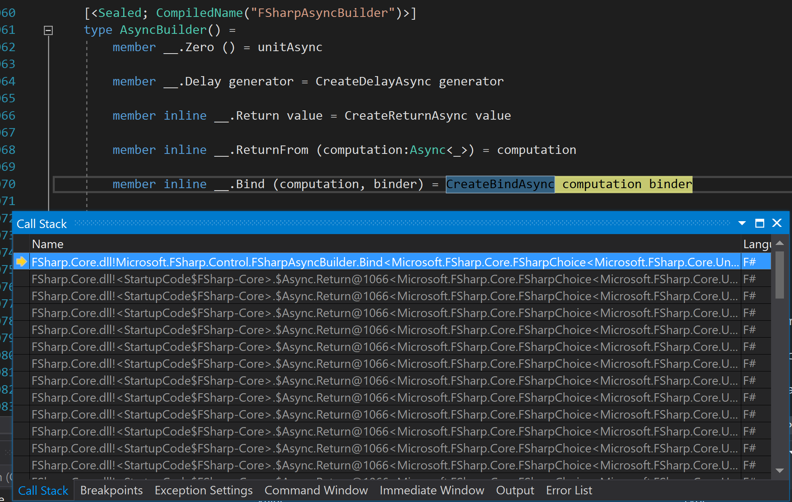

A little while ago I send a PR to fix a performance bug in Fornax, the static website generator in written in F#. This bug was so typical of performance issues that I have seen over the years I thought I do a quick write up.

## Noticing the bug

I was working on a new Fornax site when I noticed my processor fan was whirring. It doesn't happen that often, so I open Process Explorer to see which browser tabs I need to close. To my surprise it wasn't Firefox playing up, the dotnet.exe process, the dot net core host process. I assumed it must be the Fornax site that I was working on.

A bit of playing around with my site seemed to confirm this. CPU consumption jumped by a fixed amount after each refresh. The CPU usage then remained stable at that amount till the next refresh. See how consumption grows suddenly then flattens in the above screen shot.

Stable CPU consumption is almost a thread maxing out a CPU core. I remember learning this for a [Old new thing](https://devblogs.microsoft.com/oldnewthing/20061030-01/?p=29193) post, probably the one I linked to, but I remember the explanation to why as being more detailed.

I might not have noticed the issue if it wasn't for the fan. I have a few cores, the system remained responsive.

## Find the cause of the bug

As a first stab, I decided to use a technique I like to call the "poor mans profiler". Run the program in Visual Studio in debug mode, once the performance issue has been reproduce hit break a few time. If the debugger breaks at the same or similar points then you've found the code that is running slowly, since this is the mostly place that the debugger will hit. I've found quite a few bugs this way and it's often quicker than setting up a profiler (or though maybe less so now Visual Studio comes with a profiler out of the box).

Hitting break a few times didn't reveal the place where the bug was occurring, but it did give a good clue. As you can see the code is stuck an async computation expression.

A quick search of the Fornax code base shows one use of the string "async", when starting the web server. I noticed the web server used one computation expression a "socket" expression for managing web sockets. Not a async computation expression but a quick check of the signatures showed that it was probably using the async computation expression under the hood.

## The Fix

A quick look at the code makes the source of the bug obvious. Each new web socket request goes into an infinite loop paging "contentChanged" variable to see if the content has changed. Rather than page continuously it's better to make the to wait a notification when a change should be send.

I'm first thought was to use an [AutoResetEvent](https://docs.microsoft.com/en-us/dotnet/api/system.threading.autoresetevent), but we need to wait asynchronously on the event, so the thread can return the thread pool and do other useful work, and it turns out it's quite difficult to do that on an AutoResetEvent. Along the way I found it's fairly easy to wait asynchronously on a standard .NET event, which is better really as it means the bug can be fixed by using a standard .NET feature rather than relatively obscure class from the threading library.

The fixed only changes a couple of lines as well removing a mutable variable. Now the CPU consumption never really passes 1% no matter how many times you hit refresh.

## Typical

What makes this issue typical of the performance bugs I've seen over the years? Because it's not caused by a poor choice of algorithm or data structure, but a relatively simple mistake meaning that some code is repeated many more times that is needed. This is the most common cause of performance issues that I have seen.

I would say this class of performance bug is more common in GUIs where one event modifying a GUI control can lead to a cascade of events that are needed, but it certainly can occur in servers too.

It's quite easy not notice these kind of bugs, because of the vast amounts of CPU power available these days. Arguably if it's not impacting overall system performance then these kinds of bug don't matter, but I would prefer to see performance bugs get fixed to avoid an accumulation of them.

## Conclusion

It's fairly easy to miss performance bugs because of the vast amount of CPU power available to us. Performance bugs often stem from quite simple mistakes that causes code to be repeated more often than need. They can be a little trick to track down, but once found it's often quite simple to fix them.

For those interested [the PR can be found here](https://github.com/ionide/Fornax/pull/57/commits/c9adcd0e3c90bbded1994785476b6ad5180f19dc).