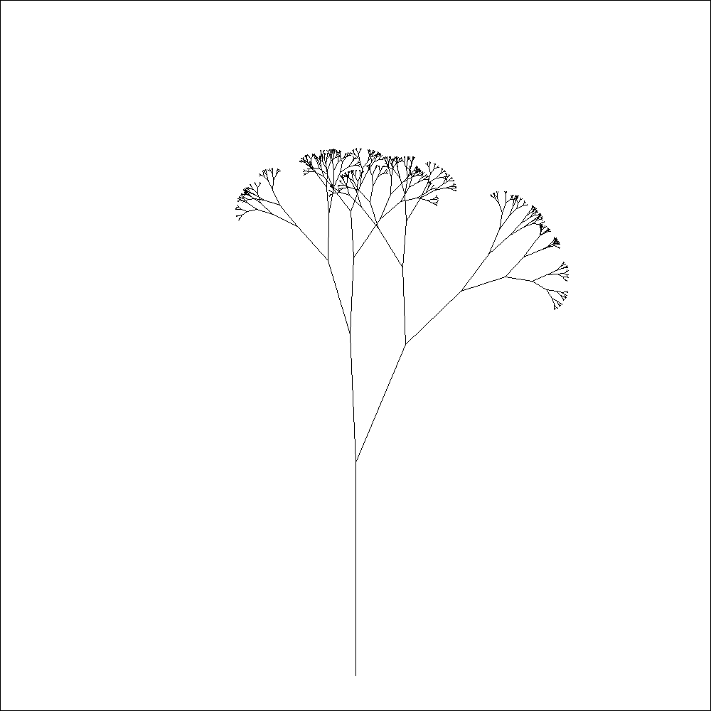
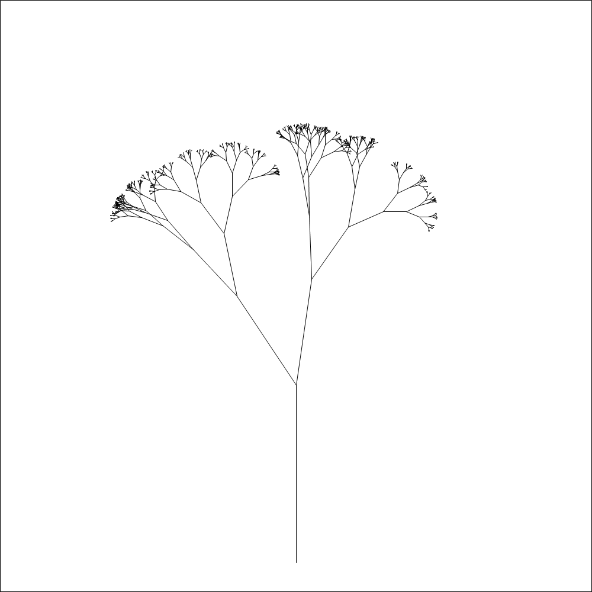
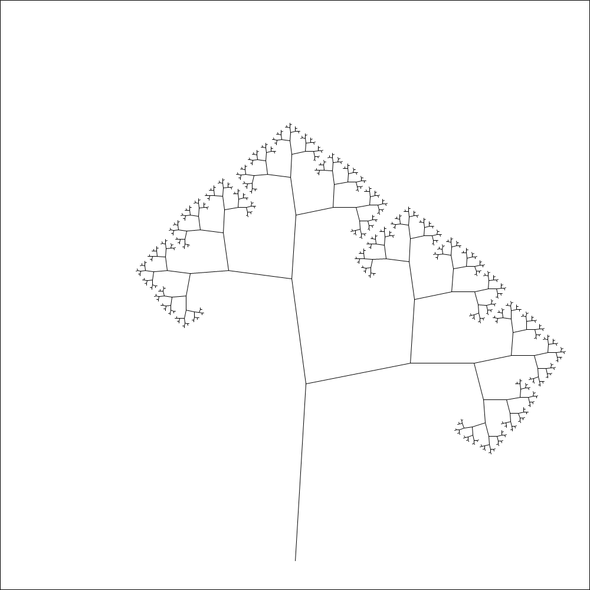
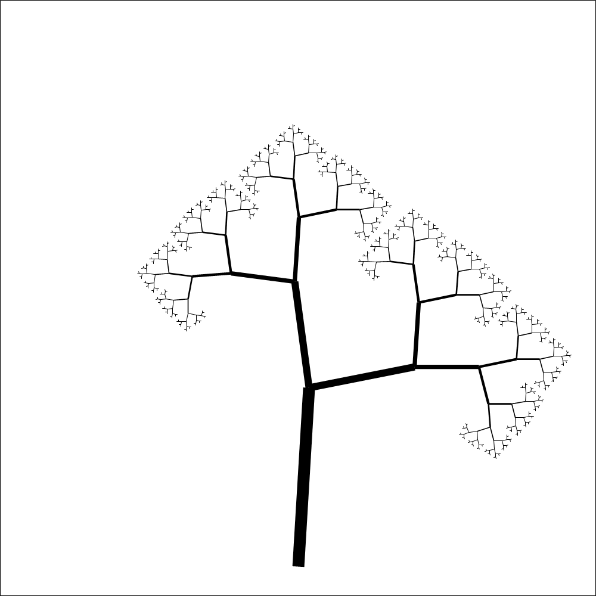
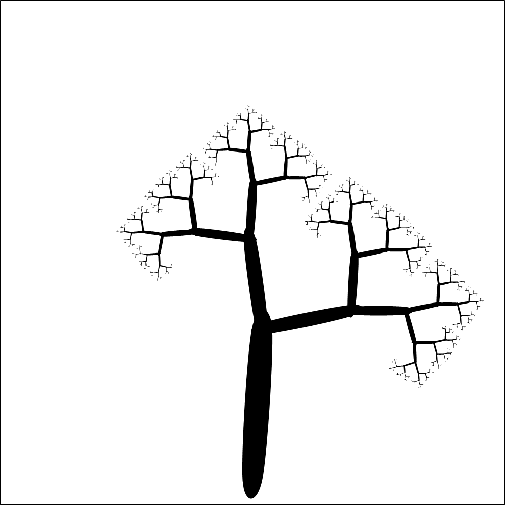
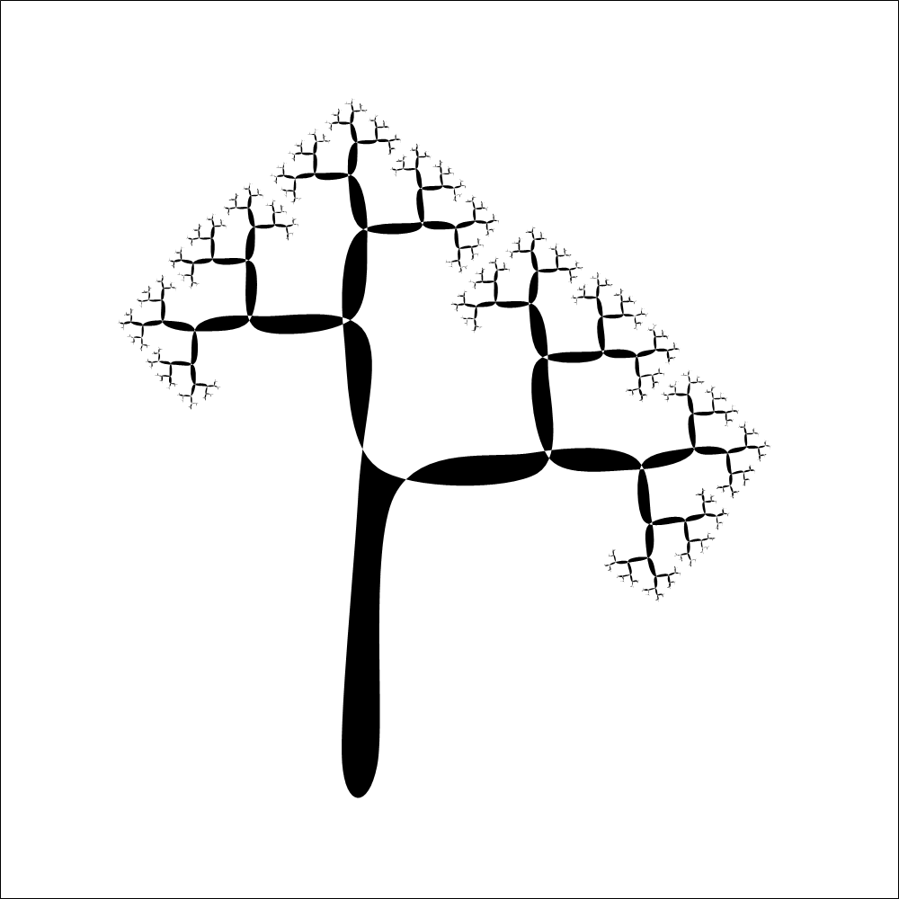

I woke up early a couple of days ago and to pass the time till the rest of the house woke up, I decided to do a little hobby programming. I wanted to do a little animation around a star fractal. I didn't find the [Koch snowflake](https://en.wikipedia.org/wiki/Koch_snowflake) astatically pleasing, so I thought I'd make my own based on a [tree fractal algorithm](http://davis.wpi.edu/~matt/courses/fractals/trees.html) that I knew gave pleasing results. This got lost somewhere a long the way and I ended up reducing my goal to creating a pleasing tree.

Rather than talk about the structure of the code, which is pretty simple, I thought it would interesting to review the sequence of images I created and talk about the decisions I made to come up with the next version. The code to produce the images is available on [github.com/robertpi/FractalTree](https://github.com/robertpi/FractalTree) and will be linked to, if you want to see what the code changes look like. I didn't store my earliest version of the algorithm in git, so some of the earlier have been reversed engineered from later version, but I think they're pretty close to what I had.

I found the process interesting of creating the tree interesting. The algorithm is pretty simple and probably took about 10 mins to implement the original version, but since doing that I spent a few hours tuning it to give prettier results. This seems to embody the trade off faced in almost every domain of software development: basic results can be achieved quickly but producing pleasing results can take much effort to tune them.

For [the first cut](https://github.com/robertpi/FractalTree/commit/47777660f2f5cb3abec3cc9c446b9d5cff553def#diff-ef807e06fd550fdcb86c5cfd1e1e628f4b7528f9aa6c3e76714242594c3a1a8b) I simply copy and pasted the pseudo code given in the [tree fractal algorithm](http://davis.wpi.edu/~matt/courses/fractals/trees.html) article and fixed it up till it was valid F#. The algorithm is simple, calculate the start and end of a branch from its length and angle, then plot the branch, adjust the length and angles before plotting the next branch.

It struck me that the tree was very pixelated. That seemed strange to me, since I can't remember that the last time I saw an image that looked pixelated, unless it was a deliberately added effect. I thought this was down to hardware improvements, and maybe a lot of it is, but it seems that most drawing libraries have some kind of smoothing turned on my default. The [System.Drawing namespace](https://docs.microsoft.com/en-us/dotnet/api/system.drawing) does not have smoothing by default, but it is simple to opt-in. Once I [added smoothing](https://github.com/robertpi/FractalTree/commit/300300eb7c7dd27ed54a508fd27f2e7d3a6598e5#diff-ef807e06fd550fdcb86c5cfd1e1e628f4b7528f9aa6c3e76714242594c3a1a8b), the pixilation went away.

I thought my trees looked more like grass. I little web searching led me to [this article about fractal trees](https://fractalfoundation.org/resources/fractivities/fractal-trees/), where the trees have a much more pleasing astatic. I noticed they weren't based on randomness but alternating angle sizes for the branches. It was fairly easy to [modify my program to produce that effect](https://github.com/robertpi/FractalTree/commit/cd4d193abe53e7601b0f8708407bf1d5c8b491a6).

I liked this style, but the trees in the article looked better. I liked the way the branches slimmed on the way up the tree, this too was a [straight forward modification](https://github.com/robertpi/FractalTree/commit/3ff962d5128166f60b619ed74b24b918b82fb5a1) (just one line moved).

The tree still looked a bit square, I was hoping for something a little more organic looking. I decided to [make the branches from ellipses](https://github.com/robertpi/FractalTree/commit/b0e18a981d9d3b26757979a690bbcfd096c861a6).

The tree was looking fairly good by this point, but I thought I could do better. I didn't like the joins where branches met, my calculations left bits sticking out which looked messy. I could have tried to tune my calculations so this didn't happen, but another approach occurred to me. The [System.Drawing namespace](https://docs.microsoft.com/en-us/dotnet/api/system.drawing) has methods that allow you to draw individual shapes like ellipses, but it also has methods let you draw polygons by defined by a list of points that form a path to plot. I decided to try and plot a whole path for the tree and then let the method [FillClosedCurve](https://docs.microsoft.com/en-us/dotnet/api/system.drawing.graphics.fillclosedcurve?view=dotnet-plat-ext-5.0) draw me a smooth tree.

This approach is tricky, it matters which order the points are passed to the [FillClosedCurve](https://docs.microsoft.com/en-us/dotnet/api/system.drawing.graphics.fillclosedcurve?view=dotnet-plat-ext-5.0) method, since this is the order they are drawn in. Any in error in the ordering of the points leads to a tree that curls around in strange way. This is differs from the approach of drawing individual branches, as the order individual branches are drawn in doesn't matter.

To make this approach work I embarked on a major refactoring of the program. This included creating a type that modelled to tree, using the type to generate a tree and then generating the path from the tree structure. The technique works okay, but I'm not that happy with [the program's structure](https://github.com/robertpi/FractalTree/blob/4e74bd76fa70ea163947ecb6cb6c241ff6fe4fe8/FractalTrees/Tree.fs), there seems to be quite a lot of repetition, particular I call Math.Sin and Math.Cos in a few different places, were I'm basically doing the same thing. But the effort of coming up with a better structure doesn't really seem worth it at this point.

I like the resulting tree a lot, but it's also not exactly what I had in mind. The calculation for the position of the edge of the branches is wrong somehow, but it's wrong in a way that produces a consistent art-deco like scroll effect, so I'll settle for that.

Now all that remains is to vary the parameters to create an animation, but that's for another day.

I hope this little tour of my programming decisions has interested you. Feel free [to get in touch](https://twitter.com/robertpi/) with any comments.
